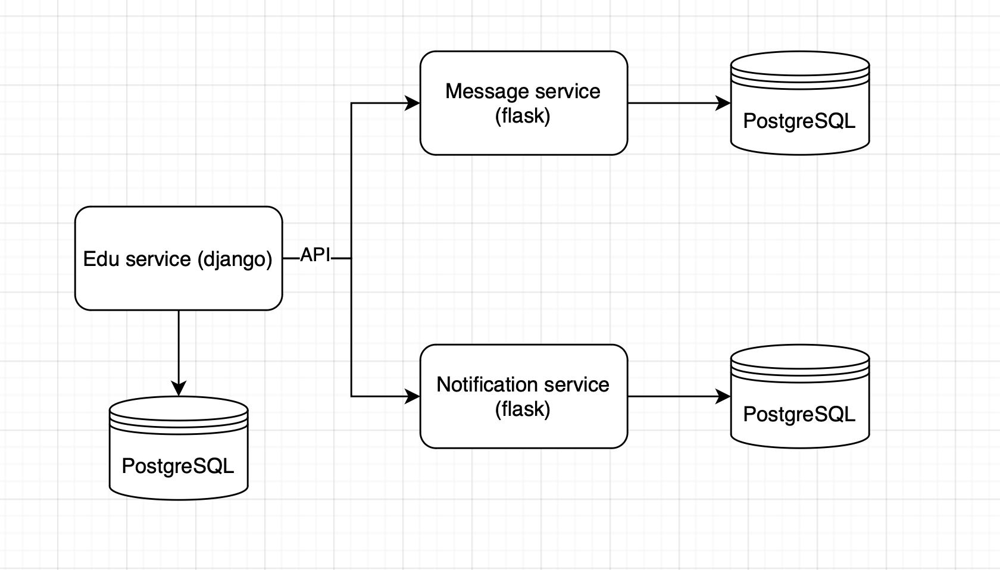
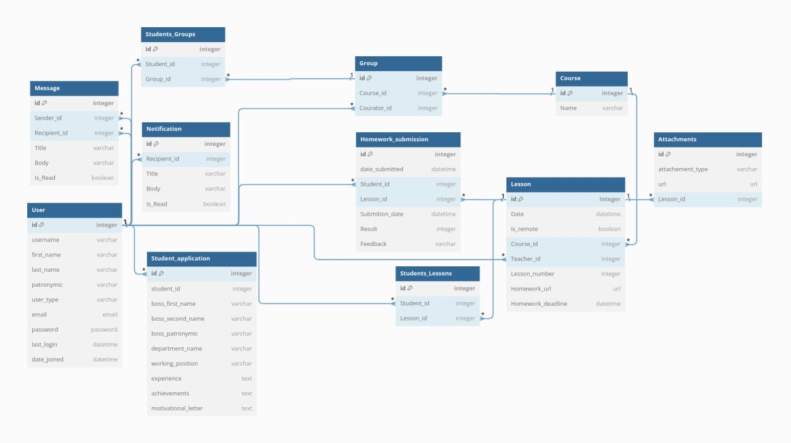

Прототип backend части образовательного сервиса, сделанного в рамках 
участия в хакатоне Adventure league. \
Представляет из себя сервис образовательной платформы, написанный на django, 
а так же микросервисы сообщений и уведомлений, сделанный с использованием
микро-фреймворка flask. Схема устройства представлена ниже. 


В настоящий момент в Edu сервисе реализовано:
* Регистрация
* JWT авторизация
* API для получения информации об учениках и процессе обучения

Требуется реализовать в Edu сервисе:
* Систему прав доступа
* API для управления учебными материалами

Для запуска сервиса достаточно ввести команду 
```
docker compose up
```
После чего заработают все необходимые сервисы и базы данных, нужные
для их работы.

Ниже можно увидеть схему базы данных
